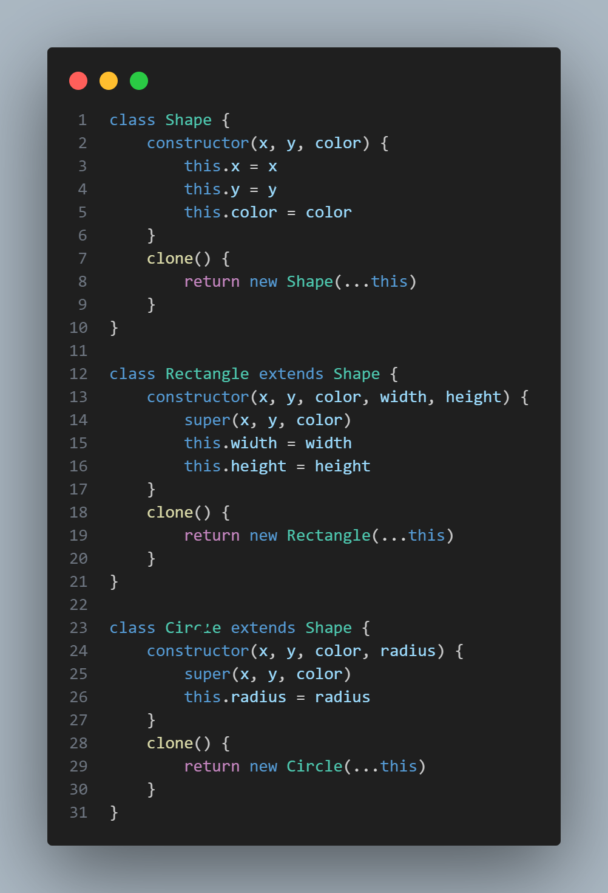

# SOLID

# Design Pattern

## Design Pattern là gì?
- Một giải pháp chung, có thể tái sử dụng cho một vấn đề thường xảy ra trong bối cảnh nhất định trong thiết kế phần mềm. Nó không phải là một thiết kế hoàn thiện có thể chuyển đổi trực tiếp thành mã nguồn hoặc mã máy. Đúng hơn, nó là một mô tả hoặc mẫu về cách giải quyết một vấn đề có thể được sử dụng trong nhiều tình huống khác nhau. Các mẫu thiết kế là các phương pháp hay nhất được chính thức hóa mà lập trình viên có thể sử dụng để giải quyết các vấn đề phổ biến khi thiết kế một ứng dụng hoặc hệ thống.

- `Design Pattern`: "đại diện cho các giải pháp đã được thử nghiệm theo thời gian và các phương pháp thực hành tốt nhất được các nhà phát triển phần mềm hướng đối tượng áp dụng theo thời gian."

## Design Pattern thường dùng trong Javascript

### Creational Design Pattern
- Creational design pattern (mẫu thiết kế tạo đối tượng) là các mẫu thiết kế tập trung vào việc tạo ra các đối tượng một cách linh hoạt và hiệu quả. Chúng cung cấp các phương pháp tạo đối tượng, che giấu chi tiết về cách tạo đối tượng và giúp giảm sự phụ thuộc giữa các lớp trong hệ thống.
- Creational design pattern được sử dụng khi: 
    1. Cần tạo ra các đối tượng một cách linh hoạt, không ràng buộc với các lớp cụ thể.
    2. Muốn che giấu các chi tiết về việc tạo đối tượng và tạo một giao diện chung để tạo đối tượng.
    3. Cần tạo ra các đối tượng có chức năng đặc biệt hoặc có cấu trúc phức tạp.
    4. Muốn tăng tính mô-đun và khả năng mở rộng của mã nguồn.

#### Builder Pattern
- Tách việc xây dựng một đối tượng phức tạp khỏi biểu diễn của nó, cho phép cùng một quá trình xây dựng tạo ra các biểu diễn khác nhau.    

**_NOTE:_**  Ảnh minh họa.

### Factory Pattern
- Định nghĩa một phương thức tạo đối tượng trong một lớp gốc, cho phép các lớp con quyết định loại đối tượng cụ thể sẽ được tạo.

**_NOTE:_**  Ảnh minh họa.

### Prototype Pattern
- Sao chép một đối tượng hiện có để tạo ra một đối tượng mới mà không ảnh hưởng đến hiệu suất của hệ thống.
- Vấn đề để áp dụng Prototype giải quyết: 
    - Giả sử bạn có một đối tượng và bạn muốn tạo một bản sao chính xác của nó. Bạn sẽ làm điều này như thế nào? Đầu tiên, bạn phải tạo một đối tượng mới cùng lớp. Sau đó, bạn phải xem qua tất cả các trường của đối tượng ban đầu và sao chép giá trị của chúng sang đối tượng mới. Đẹp! Nhưng có một nhược điểm. Không phải tất cả các đối tượng đều có thể được sao chép theo cách đó vì một số trường của đối tượng có thể ở chế độ riêng tư và không thể nhìn thấy từ bên ngoài đối tượng.
    - Có một vấn đề nữa với cách tiếp cận trực tiếp. Vì bạn phải biết lớp của đối tượng để tạo bản sao nên mã của bạn sẽ phụ thuộc vào lớp đó. Nếu sự phụ thuộc thêm không làm bạn sợ hãi thì có một nhược điểm khác. Đôi khi bạn chỉ biết giao diện mà đối tượng tuân theo chứ không biết lớp cụ thể của nó, chẳng hạn khi một tham số trong một phương thức chấp nhận bất kỳ đối tượng nào tuân theo giao diện nào đó.
    - -> Áp dụng Prototype để giải quyết

**_NOTE:_**  Ảnh minh họa.

### Singleton Pattern
- Đảm bảo rằng một lớp chỉ có một phiên bản duy nhất và cung cấp một điểm truy cập toàn cầu đến nó.

**_NOTE:_**  Ảnh minh họa.

